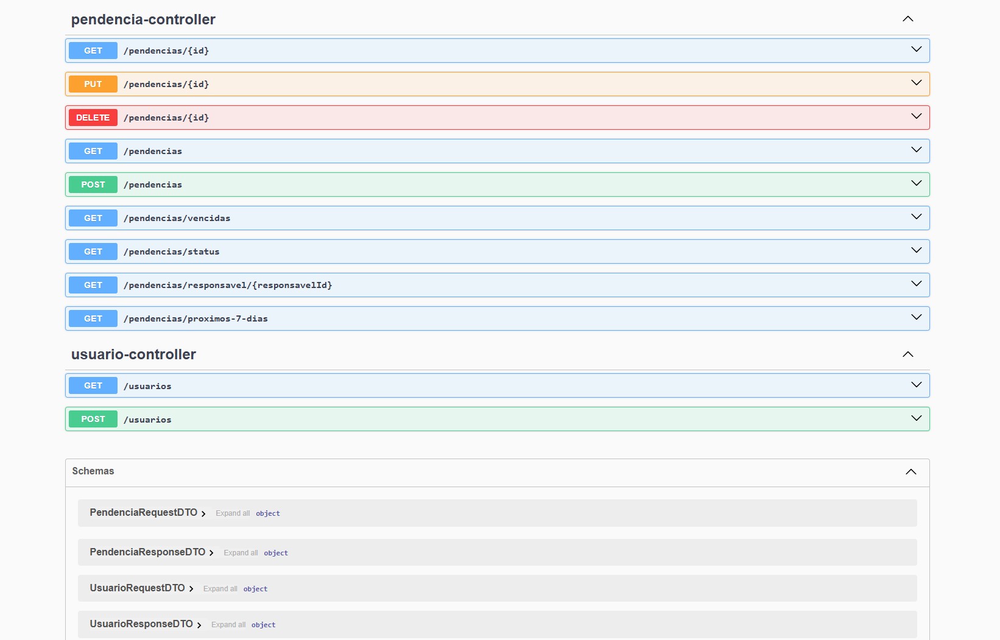

# 📌 Pendências Manager API

API REST para gerenciamento de pendências e tarefas, com controle de responsáveis, status e prazos.

Projeto desenvolvido com foco em boas práticas de desenvolvimento backend, arquitetura em camadas e aplicação de regras de negócio reais.

---

## 🚀 Objetivo

Este projeto foi criado para demonstrar habilidades em desenvolvimento backend com Java e Spring Boot, incluindo:

- Construção de APIs REST  
- Organização em arquitetura em camadas  
- Modelagem de dados e regras de negócio  
- Integração com banco de dados  
- Documentação de endpoints  

A ideia do sistema simula um cenário real de gestão de pendências, comum em ambientes corporativos, com controle por responsável, status e vencimento.

---

## 💻 Tecnologias utilizadas

- Java 17  
- Spring Boot  
- Spring Web  
- Spring Data JPA  
- H2 Database  
- Maven  
- Swagger / OpenAPI  

---

## 🧠 Regras de Negócio

- Cada pendência possui um responsável  
- Pendências podem ter status (PENDENTE, EM_ANDAMENTO, CONCLUIDO)  
- Pendências vencidas podem ser identificadas  
- Filtro por status  
- Filtro por responsável  
- Listagem de pendências próximas do vencimento  
- Tratamento de pendências sem data  

---

## 📚 Funcionalidades

- Criar pendência  
- Listar todas as pendências  
- Buscar pendência por ID  
- Atualizar pendência  
- Deletar pendência  
- Filtrar por status  
- Filtrar por responsável  
- Listar pendências vencidas  
- Listar pendências próximas do vencimento  

---

## 🏗️ Arquitetura do Projeto

- Controller → recebe requisições HTTP  
- Service → regras de negócio  
- Repository → acesso a dados  
- Entity → representação das entidades  
- DTO → transferência de dados  
- Exception Handler → tratamento de erros  

---

## 🔌 Endpoints

- POST /pendencias  
- GET /pendencias  
- GET /pendencias/{id}  
- PUT /pendencias/{id}  
- DELETE /pendencias/{id}  
- GET /pendencias/vencidas  
- GET /pendencias/status  
- GET /pendencias/responsavel/{responsavelId}  
- GET /pendencias/proximos-7-dias  
- GET /usuarios  
- POST /usuarios  

---

## ▶️ Como executar o projeto

### Pré-requisitos

- Java 17+  
- Maven  

### Clone o repositório

```bash
git clone https://github.com/leodev-est/pendencias-manager-api.git
cd pendencias-manager-api
```

### Rodar no Windows

```bash
mvnw.cmd spring-boot:run
```

### Rodar no Linux ou Mac

```bash
./mvnw spring-boot:run
```

---

## 📊 Documentação da API

Após rodar o projeto:

- http://localhost:8080/swagger-ui.html  
- http://localhost:8080/swagger-ui/index.html  

---

## 📸 Preview da API



---

## 🧪 Testes

Estrutura preparada para testes unitários e de integração.

---

## 📌 Melhorias futuras

- Autenticação com JWT  
- Banco PostgreSQL  
- Deploy em cloud  
- Testes automatizados  
- Integração com front-end  

---

## 💡 Diferenciais

- Baseado em cenário real de negócio  
- Aplicação de regras de status, responsável e vencimento  
- Estrutura organizada e escalável  
- Foco em código limpo e manutenção  

---

## 👨‍💻 Autor

Leonardo Silva Esteves  

GitHub: https://github.com/leodev-est  
LinkedIn: https://www.linkedin.com/in/leonardo-silva-esteves  

---

## ⭐ Considerações finais

Projeto desenvolvido como parte do portfólio com foco em backend Java e evolução contínua como desenvolvedor.